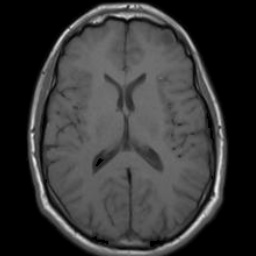
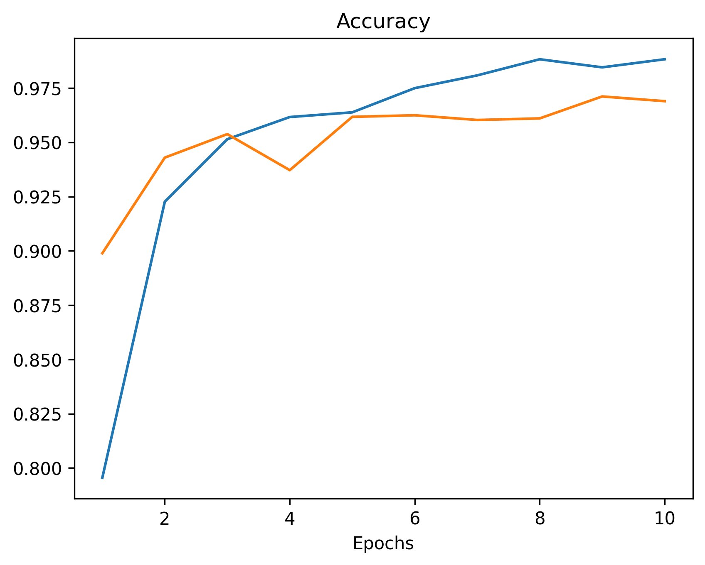
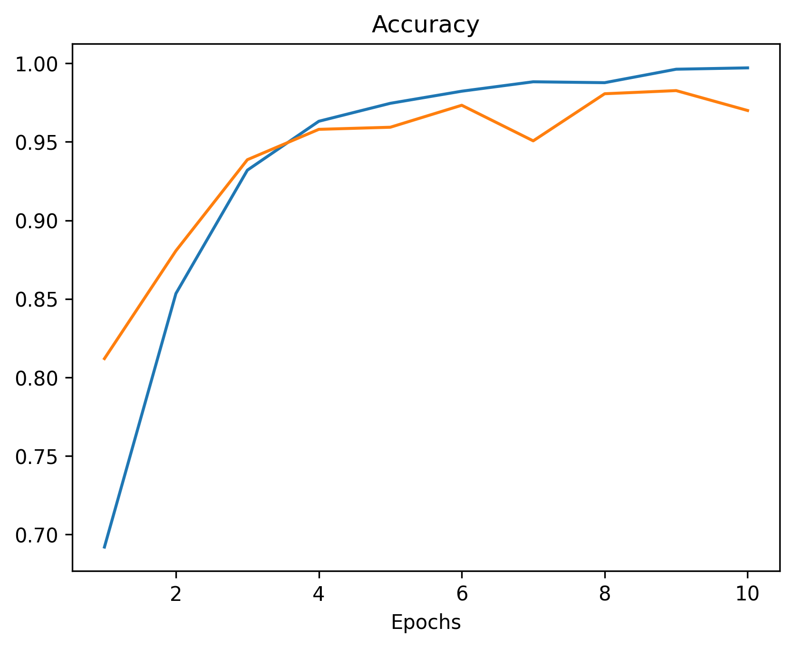
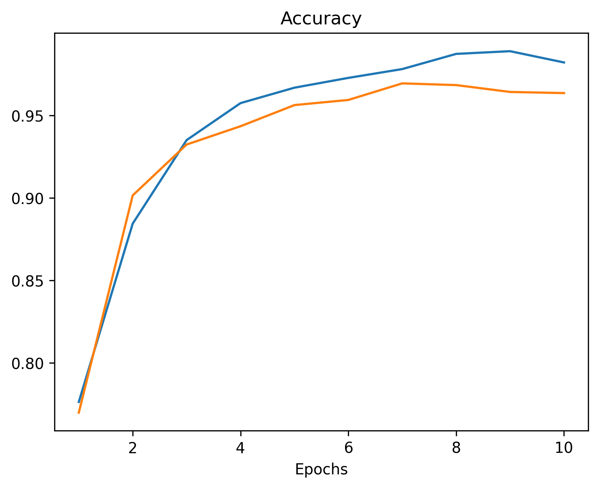
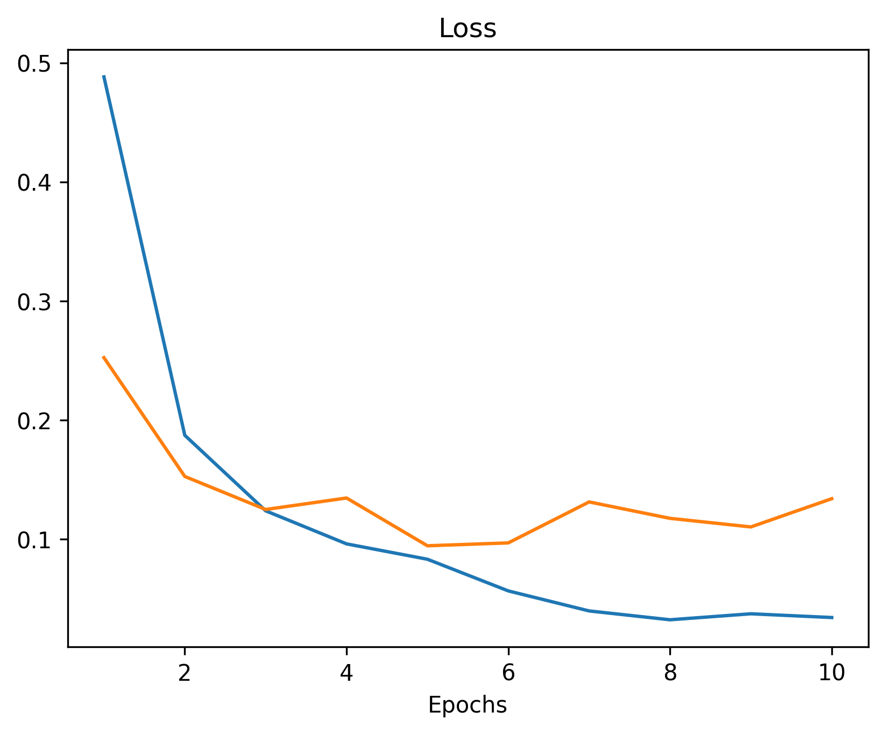
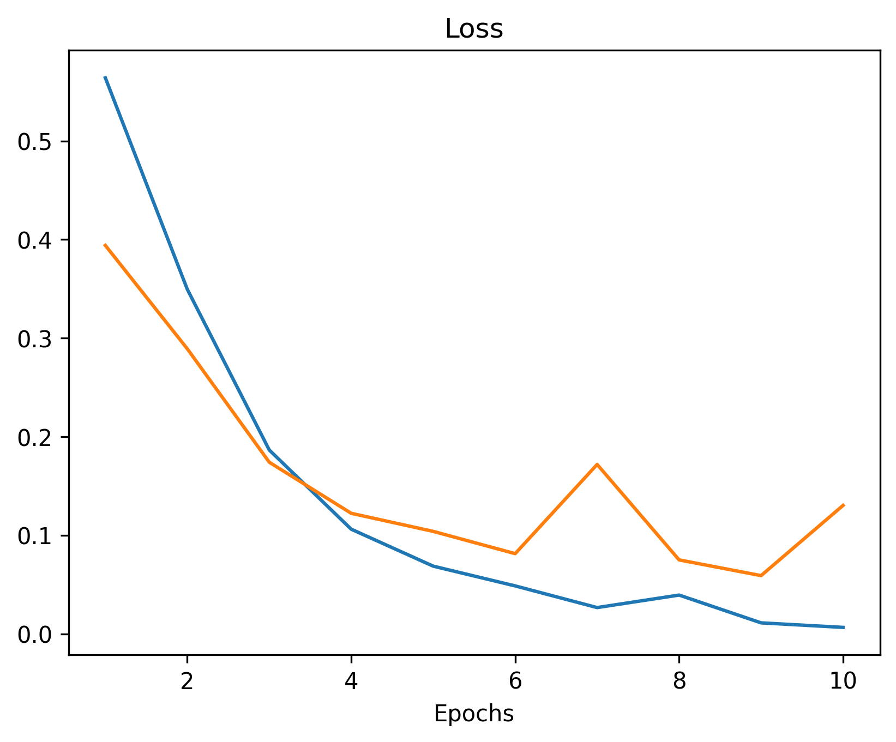
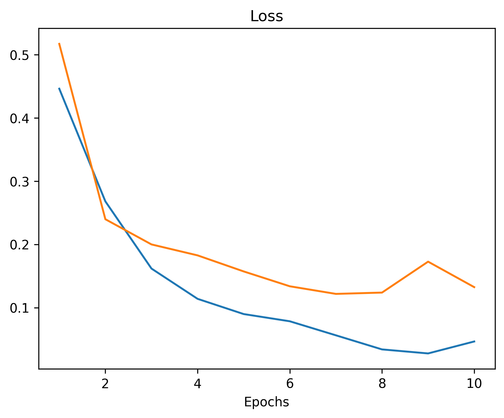

# Projet Master 2 AMIS : Réseau de neurones

### GUERIN Raphael et FERNANDEZ Sebastien


Image prise de : https://fr.wikipedia.org/wiki/Universit%C3%A9_de_Versailles_%E2%80%93_Saint-Quentin-en-Yvelines


## Présentation du projet

Ce projet a pour objectif d'implémenter et d'entraîner un réseau de neurones à l’aide des frameworks PyTorch ou Keras, afin de résoudre un problème spécifique. Dans notre cas, nous avons choisi d'entraîner un réseau de neurones sur des images d'IRM et de CT-scan du cerveau. L’objectif est d’entraîner un réseau de neurones capable, à partir d'une image, de déterminer si elle provient d’un patient possédant une tumeur ou non. 

Pour commencer, nous avons recherché un dataset adapté. Celui que nous avons utilisé provient de [Kaggle](https://www.kaggle.com/datasets/murtozalikhon/brain-tumor-multimodal-image-ct-and-mri). Ce dataset contient 9620 images de taille différentes. 




## Problématique

Est-il possible d'entraîner suffisamment un réseau de neurones pour qu’il fournisse un diagnostic avec un taux de réussite proche de 100 % ? Et, quel type de réseau de neurones est le plus performant pour cette tâche ?

Dans le projet nous avons donc implémenté : 
- Un **MLP (Multilayer perceptron)** à 4 couches
- Un **CNN (Convolutional neural network)**


## MLP

### Dataset

Pour le MLP, étant un réseau de neurones prenant en entrée la taille des données utilisé, il fallait un dataset un peu plus simple que le dataset choisit. Nous avons remarqué que le dataset possédait un sous [dataset](https://www.kaggle.com/datasets/thomasdubail/brain-tumors-256x256) contenant 3096 images d'IRM, de tailles 256x256. Nous avons adapté le dataset afin de réduire encore la taille des images et simplifier l’entraînement. Toutes les images ont été redimensionnées à 128x128 pixels, et bien qu’elles possèdent initialement 3 canaux de couleurs (rouge, vert, bleu), nous avons conservé uniquement les niveaux de gris. Cela permet de réduire la taille des données en entrée, tout en préservant l’essentiel des informations nécessaires pour l’analyse des images. 

Ainsi, chaque image redimensionnée est convertie en un vecteur plat de taille 128×128=16384 (au lieu de 3x256x256=131072), correspondant à la taille de la couche d’entrée du réseau.

Les images ont ensuite été réparties de la façon suivante : 
- 70% des images pour le training
- 30% des images pour le testing

Le dataset contient des images réparties en quatre catégories :
- **Glioma**
- **Meningioma**
- **Normal (absence de cancer)**
- **Pituitary**


### Modèle

Le MLP a été défini avec l’architecture suivante :
- Une couche d’entrée contenant 16384 neurones (taille des images converties en vecteurs).
    - Deux couches cachées :
        - La première avec 4096 neurones.
        - La seconde avec 512 neurones.
- Une couche de sortie composée de 4 neurones.

Les connexions entre les couches sont assurées par des fonctions linéaires (Linear layers) suivies de la fonction d’activation ReLU (Rectified Linear Unit) pour introduire des non-linéarités.

Le modèle est défini comme suit :
``` python
class MLP(nn.Module) :
  def __init__(self, input_size=16384, output_size=4, layers=[4096, 512]):
    super().__init__()
    self.layers = nn.ModuleList()
    self.layers.append(nn.Linear(input_size, layers[0]))
    self.layers.append(nn.ReLU())
    self.layers.append(nn.Linear(layers[0], layers[1]))
    self.layers.append(nn.ReLU())
    self.layers.append(nn.Linear(layers[1], output_size))

  def forward(self, x):
    for layer in self.layers:
      x = layer(x)
    return x
```


### Entraînement

Pour entraîner ce modèle, nous avons suivi les étapes suivantes :

1. **Prétraitement des données :**
   - Redimensionnement des images à 128x128 pixels.
   - Conversion des images en niveaux de gris (un seul canal).
   - Mise à plat des images en vecteurs de taille 16384.
   - Normalisation des valeurs des pixels dans l’intervalle [0,1].

2. **Configuration de l’entraînement :**
   - Optimiseur : Adam, avec un taux d’apprentissage initial fixé à 0.001.
   - Fonction de perte : Cross-Entropy Loss, adaptée à la classification en 4 catégories.
   - Taille des batchs : 197 images par batch (car 197x11 = 2167 notre nombre d'images) pour le training et 32 images par batch pour le testing.
   - Nombre d’époques : 5, 10, 15 (pour comparer).

3. **Résultat :**
```Epoch [10/10], Accuracy: 59.13%```


### Forces et Faiblesses

**Forces :**
- Le modèle est léger et rapide à entraîner.
- Prétraitement des données optimisé pour la mémoire.

**Faiblesses :**
- Performance limitée à cause de l’architecture MLP.
- Le modèle ne prend pas en compte les relations spatiales entre les pixels.


### Améliorations possibles

Pour améliorer ce modèle, plusieurs pistes sont envisageables :

- Entraînement sur un nombre d'époques plus élevé : Prolonger la durée de l’entraînement pourrait permettre au modèle de converger davantage et potentiellement d'améliorer sa précision.
- Augmentation des données : Appliquer des transformations comme des rotations, des zooms ou des inversions pourrait enrichir le dataset et améliorer la généralisation.
- Réduction encore plus marquée de la dimensionnalité : Explorer des approches comme les autoencodeurs pour compresser les images avant leur entrée dans le MLP.
- Exploration de la topologie des couches : Ajouter ou supprimer des couches cachées ou expérimenter avec un nombre différent de neurones.
- Utilisation de prétraitements avancés : Introduire des méthodes comme la détection de contours ou des transformations spectrales pourrait améliorer les performances.


## CNN

### Dataset

Pour le CNN, nous avons voulu utiliser le dataset en entier. Comme dit précédemment, le dataset possède des images de tailles variées et pas forcément carré, chacune est caractérisé par la présence ou non d'une tumeur (classification en "*Tumor*" et "*Healthy*").
Dans un réseau convolutif, nous avons besoin d'avoir des entrées de taille fixe. On commence donc à redimensionner les images en (128 x 128) pixels. Nous avons choisi cette taille car elle permet de garder assez d'informations pour la détection, tout en limitant le nombre de paramètre du modèle.
On garde les 3 canaux rgb, car l'impact sur le nombre de paramètre du modèle est moindre (contrairement au MLP) et après avoir entraînement, la précision du modèle est légèrement meilleure en gardant les images en couleurs.
Pour l'entraînement, nous avons divisé les images en dataset d'entraînement (training) et de validation (validation) avec une séparation de 70% / 30%. Nous avons mélangé les images avant de les mettre en batch afin de limiter l'overfitting (plus particulièrement pour le modèle commun IRM et CT Scan).


### Modèle

Le modèle a été conçu avec *Keras*. Il contient les couches suivantes:
- Un Rescaling, il permet de modifié l'input pour avoir des valeurs d'entrées du réseau sur [0, 1], ça permet d'améliorer la stabilité et la vitesse d'apprentissage du modèle.
- Une première couche de convolution avec un filtre de taille (5, 5), un filtre (5, 5) permet de détecter des motifs de tailles moyenne dès la première étape.
- Ensuite, on a 3 couches convolutives avec des filtres (3, 3), propage les motifs de l'image au fur des convolutions.
- Après chacune des 4 couches convolutives, on a une couche de Pooling (2, 2) qui permet de réduire la dimension ainsi qu'agrégé les informations.
- On flatten la représentation enrichie de l'image en sortie de la dernière couche de Pooling ($8*8*192 = 12288$).
- Pour finir on a 3 couches denses de tailles:
  - 1024 avec activation relu.
  - 128 avec activation relu.
  - 2 avec activation softmax, permet d'avoir une sortie de la forme d'une probabilité de Tumeur ou non (la somme des 2 probabilités est égale à 1).


``` python
def cnnModel():
  model = Sequential()
  model.add(keras.layers.Input(shape=(128, 128, 3)))
  model.add(keras.layers.Rescaling(1./255))
  # Layer 1
  model.add(keras.layers.Conv2D(32, (5, 5), padding='same', activation='relu'))
  model.add(keras.layers.MaxPooling2D((2, 2)))
  # Layer 2
  model.add(keras.layers.Conv2D(64, (3, 3), padding='same', activation='relu'))
  model.add(keras.layers.MaxPooling2D((2, 2)))
  # Layer 3
  model.add(keras.layers.Conv2D(128, (3, 3), padding='same', activation='relu'))
  model.add(keras.layers.MaxPooling2D((2, 2)))
  # Layer 4
  model.add(keras.layers.Conv2D(192, (3, 3), padding='same', activation='relu'))
  model.add(keras.layers.MaxPooling2D((2, 2)))

  # Flatten
  model.add(keras.layers.Flatten())

  # MLP
  model.add(keras.layers.Dense(1024, activation='relu'))
  model.add(keras.layers.Dense(128, activation='relu'))
  model.add(keras.layers.Dense(2, activation='softmax'))

  model.compile(optimizer=keras.optimizers.Adam(), loss=keras.losses.CategoricalCrossentropy(), metrics=['accuracy'])
  return model
```


### Entraînement

Pour entraîner ce modèle, nous avons suivi les étapes suivantes:

1. **Prétraitement des données :**
   - Redimensionnement des images en 128x128 pixels.
   - Création du dataset et des batchs.
     - On distingue 3 datasets: celui des scanners (4618 images), celui des IRM (5000 images) et le dataset commun contenant toutes les images mélangées (9618 images).
   - Normalisation des valeurs des pixels dans l’intervalle [0,1].

2. **Configuration de l’entraînement :**
   - Optimiseur : Adam.
   - Fonction de coût : Cross-Entropy Loss, adaptée à la classification en catégories (Healthy et Tumor).
   - Taille des batchs : 64 images par batch.
   - Nombre d’époques : 10.
   - Sauvegarde de la meilleure configuration (par rapport à la validation loss) du modèle pendant l'entraînement et chargement à la fin des 10 époques (utile en cas d'overfitting).

3. **Entraînement des modèles**
   - Comme nous avons décidé de diviser le datasets en 3, nous allons entraîner 3 modèles pour voir si un type d'imagerie est mieux que l'autre pour la reconnaissance de tumeur et si ces 2 types peuvent être évaluer par le même modèle (en utilisant la même forme de modèle mais pour obtenir des paramètres différents).

Les courbes de coût (loss) et de précision (accuracy) pour les trois modèles (CT, IRM et Commun) entraînés sur 10 époques.

| Training graphs for CT Scan model      | Training graphs for MRI model            | Training graphs for commun model               |
|----------------------------------------|------------------------------------------|------------------------------------------------|
|  |  |  |
|          |          |          |


### Résultats obtenus

Après l'entraînement sur 10 époques, on voit que nos modèles (avec la même architecture) possèdent une précision élevé et très proche les unes aux autres, avec le modèle des IRMs légèrement plus performant que les 2 autres.

| Modèle        | Dataset de validation utilisé | Loss   | Accuracy |
|---------------|-------------------------------|--------|----------|
| Modèle CT     | Images de scanner CT          | 0.0946 | 96.2%    |
| Modèle MRI    | Images d'IRM                  | 0.0591 | 98.3%    |
| Modèle Commun | Images de CT + IRM            | 0.1218 | 96.9%    |


### Forces et Faiblesses

1. Forces
   - Capacité à déterminer si un patient à une tumeur avec soit un scanner, soit une IRM (à partir d'un seul modèle).
   - Architecture du modèle simple.
   - Précision élevé après un nombre faible d'époques.

2. Faiblesses
   - Nombre de paramètre relativement élevé.
   - Surapprentissage possible (malgré les mesures mises en place).
   - Manque de transformation (rotation, inversion) des données d'entraînement pour rendre le modèle plus robuste.


### Améliorations possibles

Nous pourrions utiliser des méthodes pour améliorer le modèle CNN actuel, par exemple:
- Comme pour le MLP, **l'augmentation de données**, que ce soit par l'augmentation du nombre d'images ou par le biais de transformation sur les données existantes, serait possible et permetterait d'améliorer la robustesse et de limiter l'effet d'overfitting.
- **L'optimisation des hyperparamètres** pourrait être une option, bien qu'on ai essayé plusieurs types de couches et taille de filtres, il existe certainement un modèle légèrement plus performant.
- Entraînement sur un **nombre d'époques plus élevé** : Prolonger la durée de l’entraînement pourrait permettre au modèle de converger davantage et potentiellement d'améliorer sa précision.

- Nous pourrions utiliser d'autres approches, par exemple en **changeant l'architecture** du modèle en passant d'une structure de CNN vers un transformers.
- Une autre amélioration qui n'est cette fois-ci pas en lien avec la précision, serait de donner la zone dans où la tumeur se trouve (si elle existe), ça pourrait être une zone rectangulaire ou bien une heatmap avec des couleurs plus vive au centre de la tumeur, ça permetterait au modèle d'être utilisé par des humains, notamment pour aider à faire des diagnostics.


## Conclusion

Dans le cadre de ce projet, l’objectif était de déterminer si un réseau de neurones pouvait atteindre un taux de réussite proche de 100 % pour un diagnostic, et de comparer la performance de deux types de réseaux de neurones : un MLP (Multilayer Perceptron) et un CNN (Convolutional Neural Network).

**Pour le MLP**, malgré la mise en place d'un réseau avec 4 couches, le modèle n’a atteint qu'une précision de 59,13% après 10 époques d’entraînement. Cette précision relativement faible peut s’expliquer par la nature du MLP qui, bien qu’efficace pour certaines tâches, n’est pas particulièrement adapté aux données d’image complexes, comme celles utilisées dans ce projet. 

**Pour le CNN**, qui est spécifiquement conçu pour les tâches de traitement d'images, les résultats parle d'eux mêmes. En utilisant des images de scanner CT, nous avons atteint une précision de 96,2%. Lors de l’utilisation d'images d’IRM, la précision a augmenté à 98,3%. Enfin, en combinant les images de CT et IRM nous avons une précision de 96,9%.

En conclusion, il est effectivement possible d’obtenir un modèle avec un taux de précision élevé, proche de 100%, en utilisant des architectures adaptées comme les CNN. Le MLP, en revanche, n’a pas donné des résultats suffisamment bons dans ce contexte, ce qui montre qu’il n’est pas toujours le meilleur choix pour des tâches de classification sur des données d’images complexes.
